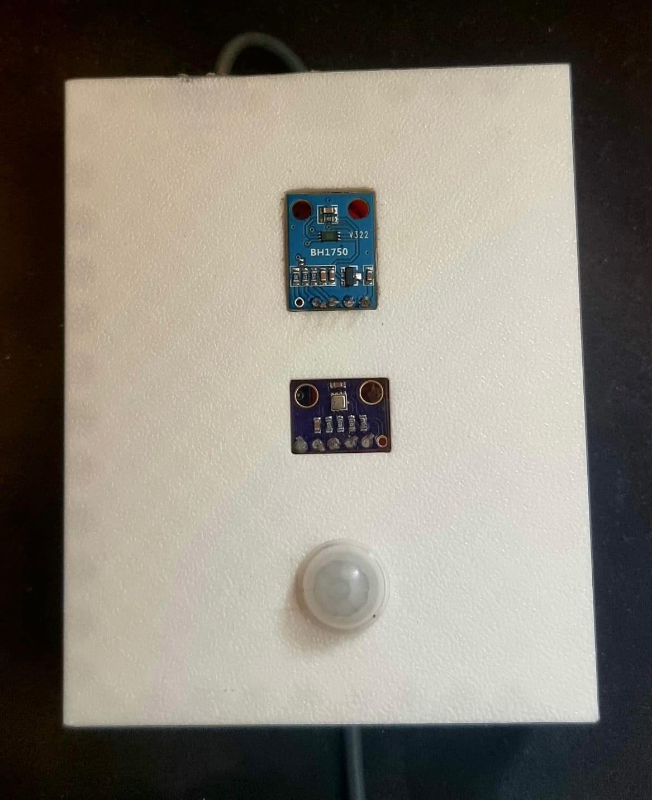

# Room AC/Light Usage Monitor (ESP32)

A tiny, low-cost IoT node that senses **ambient temperature**, **room light level**, and **motion**, timestamps readings in local Israel time (IST/IDT), and **securely uploads** buffered samples over Wi-Fi for a simple building-usage dashboard.

---

## ✨ Features

* **Sensors**: BME280 (temperature only), BH1750 (lux), PIR (motion with latch)
* **Sampling**: 10 Hz internal refresh; **1 sample packaged every 10 s**
* **Buffering & Upload**: JSON array POST over HTTPS with CA bundle; auto-clear on 2xx
* **Wi-Fi**: Try a configured closed SSID first; fallback to the strongest **open** network
* **Time**: SNTP sync + local timezone (IST/IDT), human-readable timestamps
* **Resilience**: No reboots due to Wi-Fi hiccups; background reconnect & rescan

---

## 🧱 Architecture

```
+-----------------+        +-----------------+        +---------------------+
|  sampler_task   | 10 Hz  | publisher_task  | 10 s   |   sender_task       |
|  (keeps sensor  |------->| build sample    |------->| POST buffered JSON  |
|  cache fresh)   |        | + local time    |        | over HTTPS          |
+-----------------+        +-----------------+        +---------------------+
        ^                           |                          |
        |                           v                          |
   Sensors API                 Uploader buffer            Wi-Fi (STA)
 (BH1750, BME280, PIR)           (ring array)          closed→open fallback
```

---

## 📦 Data Model (JSON)

Each upload is an array of objects:

```json
[
  {
    "date": "YYYY-MM-DD",
    "time": "HH:MM:SS",
    "temp": 24.6,          // Celsius
    "lux":  312.5,         // Lux
    "motion": true,        // Instant OR latched since last publish
    "building": "Ficus",
    "number":   "101"
  }
]
```

---

## 🔌 Hardware & Pinout

* **MCU**: ESP32 (ESP-IDF 5.x)
* **I²C**: SDA **GPIO 21**, SCL **GPIO 22** (BH1750 + BME280 on same bus)
* **PIR**: Signal **GPIO 27** (any-edge interrupt + latch)

> Tip: BH1750 default I²C address is `0x23` (or `0x5C` if ADDR→VCC). BME280 default is `0x76` (`0x77` if SDO high).

### 📷 First Prototype - Exposed Hardware


### 📷 Final Prototype - Soldered & Packaged with 3D Printed Case

 

---

## 🛠️ Build & Flash (ESP-IDF)

1. Install ESP-IDF ≥ 5.x and set up the environment.
2. Configure your serial port and board.
3. Build & flash:

   ```bash
   idf.py build
   idf.py -p COMx flash monitor
   ```

---

## ⚙️ Configuration

### Device identity

Edit `main/device_id.h` to set your default **building** and **room number**:

```c
#define DEVICE_BUILDING_DEFAULT "Ficus"
#define DEVICE_NUMBER_DEFAULT   "101"
```

You can later move these to NVS or OTA-config.

### Wi-Fi (closed-first, open fallback)

Edit `main/wifi.c` and set your **closed** SSID & password. *Do not commit secrets.* If closed Wi-Fi fails within \~20 s, the firmware automatically scans and connects to the strongest **open** network.

### Timezone & SNTP

The firmware starts SNTP (pool/google/windows) and sets the TZ string for **Israel (IST/IDT)** so printed timestamps match local time.

### Upload endpoint

Initialize the uploader with your HTTPS endpoint (default example shown in `app_main.c`). Uses the built-in CA bundle; no custom cert flashing required.

---

## ⏱️ Runtime Behavior

* **10 Hz** sensor refresh keeps a local cache up to date.
* Every **10 s**, the publisher:

  * Reads temp/lux/instant motion and a **latched motion** flag (true if any motion occurred since last publish),
  * Stamps the sample with local time,
  * Adds building/room identifiers,
  * Buffers it for upload, then **clears the motion latch**.
* Every **10 s**, the sender posts any buffered samples as one JSON array. On 2xx, the buffer is cleared; otherwise it’s retained for retry.

---

## 🧪 Logs (examples)

```
[SAMPLER] Raw: Temp=23.98C Lux=305.4 Motion=true
[APP] [2025-09-08 11:05:10] Temp=24.02C Lux=310.1 Motion(inst)=false Motion(latched)=true Ficus/101
[UPLOADER] JSON payload: [{"date":"2025-09-08","time":"11:05:10", ... }]
```

---

## 🧯 Troubleshooting

* **No time / shows "UNSYNCED"**: Ensure the device is online; SNTP will update shortly.
* **No Wi-Fi**: Double-check closed SSID/pass, or verify an open SSID is in range. Power-cycle the AP if needed.
* **No uploads**: Confirm endpoint URL is reachable and supports HTTPS. Check HTTP status codes in the log.
* **BH1750/BME280 not detected**: Verify I²C wiring and the sensor addresses; check pull-ups if using custom boards.
* **PIR always HIGH/LOW**: Adjust sensor sensitivity/delay, confirm GPIO and ground reference.

---

## 🚀 Roadmap

* NVS/OTA configuration for building/room and Wi-Fi
* Add humidity/pressure (BME280) and occupancy heuristics
* Local persistent queue for network outages
* Web dashboard auto-provisioning
